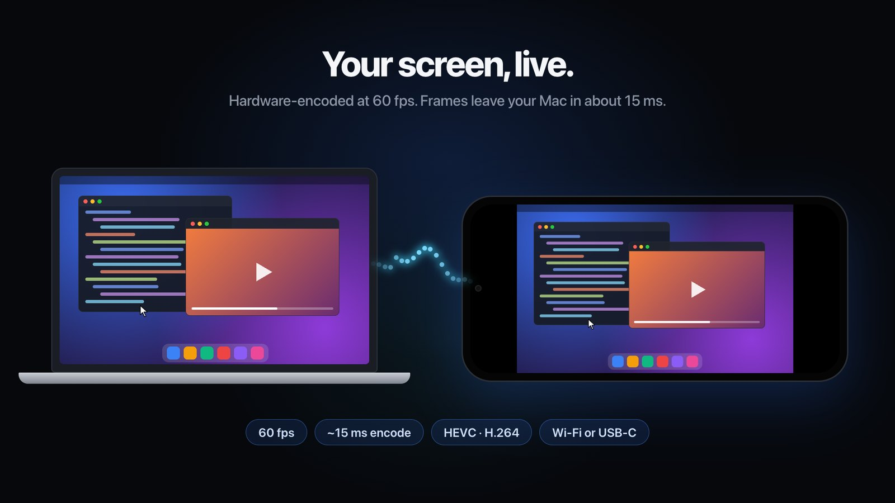
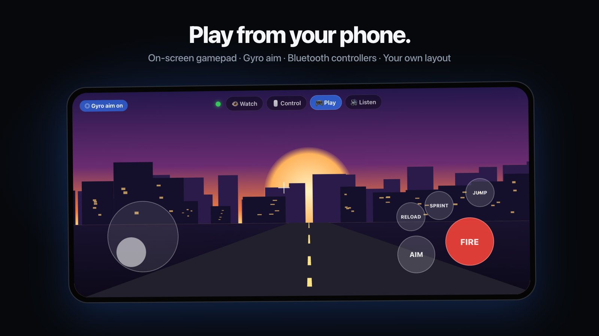
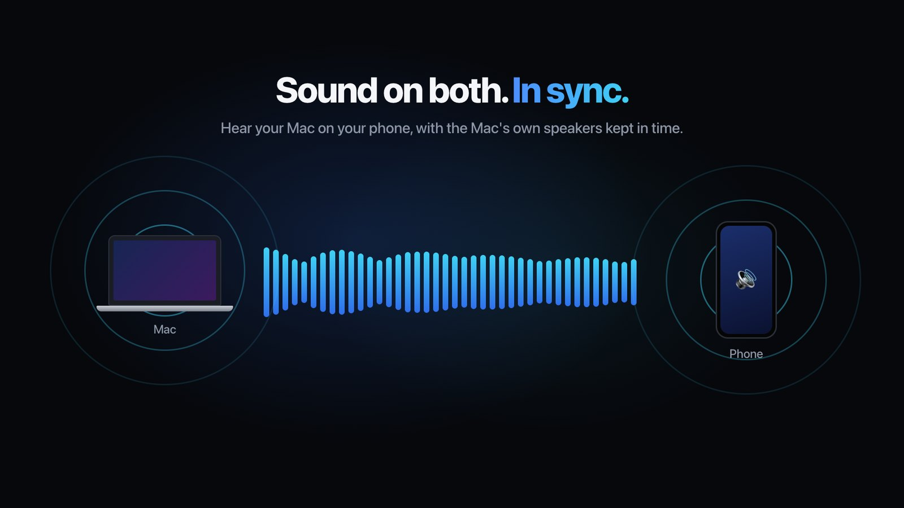
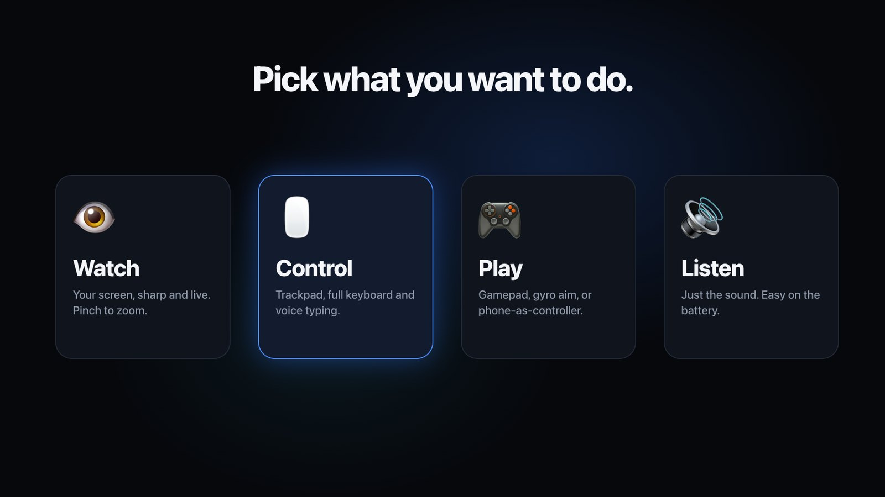
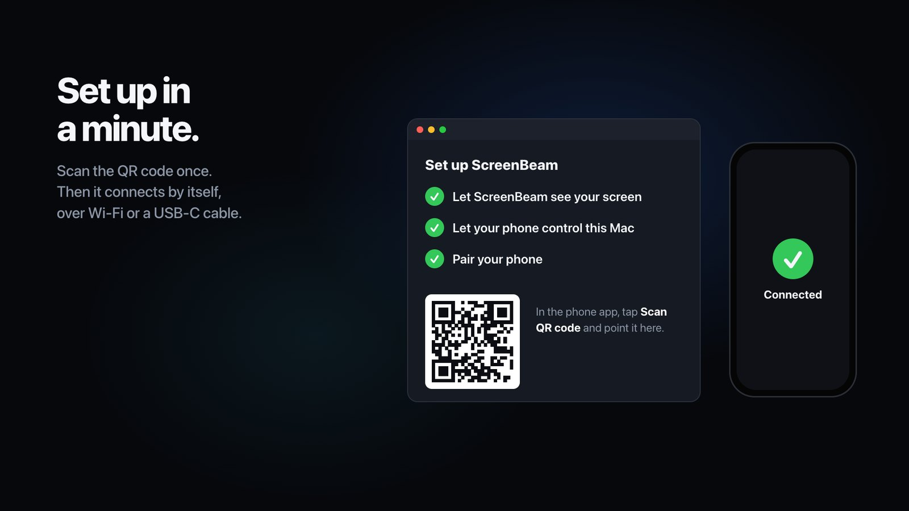

# ScreenBeam

Stream your Mac's screen and sound to an Android phone, and use the phone as a mouse, keyboard or game controller. Works over Wi-Fi or a USB-C cable.



- **Sharp and fast:** hardware HEVC/H.264 encoding, about 10–15 ms from capture to send in gaming mode.
- **Sound:** Mac audio plays on the phone. It can also keep playing on the Mac, delayed to stay in sync with the phone.
- **Control:** trackpad, touch, full keyboard with F-keys and numpad, voice typing, an on-screen gamepad with gyro aiming, and Bluetooth controllers.
- **Modes:** full video, controller only (no video), or sound only.

Free and open source under the [MIT License](LICENSE). [Watch the 40-second intro video](../../releases/latest/download/ScreenBeam-promo.mp4).

| | |
|---|---|
|  |  |
|  |  |

**Requirements:** macOS 14.2 or later (Apple Silicon or Intel), and Android 8+ (tested on a Galaxy S24 Ultra).

## Download

Get both files from the [latest release](../../releases/latest):

| File | Install on |
|---|---|
| `ScreenBeam-mac.zip` | Your Mac |
| `ScreenBeam.apk` | Your Android phone |

## Install

### Mac
**Quickest:** paste this into Terminal. It downloads the latest release, checks its checksum and signature, and installs it into Applications without the "unidentified developer" warning ([read the script first](install.sh)):

```sh
curl -fsSL https://raw.githubusercontent.com/Monem-Benjeddou/ScreenBeam/main/install.sh | bash
```

Run the same command again later to update.

Or install it yourself:

1. Unzip `ScreenBeam-mac.zip` and drag **ScreenBeam.app** into **Applications**.
2. Open it. ScreenBeam isn't notarized by Apple (that requires a paid developer account), so macOS blocks the first launch:
   - **macOS 15 or later:** close the warning, open **System Settings › Privacy & Security**, scroll down, and click **Open Anyway** next to ScreenBeam.
   - **macOS 14:** right-click ScreenBeam.app, choose **Open**, then click **Open** again.
   - **Or**, in Terminal: `xattr -dr com.apple.quarantine /Applications/ScreenBeam.app`
3. Follow the setup checklist in the ScreenBeam window. Each step ticks off as soon as it's done:
   1. **Screen Recording.** Click *Open Settings*, turn on ScreenBeam, then click *Relaunch*.
   2. **Accessibility.** Lets the phone control the mouse and keyboard. Skip it if you only want to watch or listen.
   3. **Pair your phone.** See below.
4. If macOS asks about local network access, incoming connections or audio recording, click **Allow**.

### Phone
1. Copy `ScreenBeam.apk` to the phone (Quick Share, Google Drive, a USB cable…) and open it. Allow *Install unknown apps* when asked.
   With USB debugging on, `adb install ScreenBeam.apk` also works.
2. Open ScreenBeam and tap **Scan QR code**. Point the camera at the QR code in the Mac window. This pairs and connects in one step.

Once paired, the phone finds the Mac on its own next time. If your router blocks discovery, type the address listed under **Connect manually** in the Mac window.

## Using it

### Pick what you want to do
The bar at the top of the phone screen has four goals:

| Goal | Modes | For |
|---|---|---|
| 👁 **Watch** | View | Watching the screen. Pinch to zoom, drag to pan, double-tap to zoom in or out |
| 🖱 **Control** | Mouse · Touch · Keys | Using the Mac from the phone |
| 🎮 **Play** | Game · Pad | Games. *Pad* turns the phone into a controller with no video, for when you play on the Mac's screen |
| 🔊 **Listen** | Sound | Mac audio only, no video. Saves battery |

**Control modes**
- **Mouse:** a laptop-style trackpad. Tap to click, long-press then drag to drag, two fingers to right-click or scroll.
- **Touch:** your finger is the cursor. Tap where you want to click, and drag with two fingers to scroll.
- **Keys:** a full keyboard with a trackpad above it. *Fn·Num* switches to F1–F12, the numpad and the navigation keys (useful for game mod menus). Modifier keys stay on until the next key, so shortcuts work.
- 🎤 dictates text and **Aa** types it. The text is typed on the Mac.

**Game mode** has a GTA V-style layout:
- A floating stick (WASD). Drag anywhere else to look around.
- FIRE and AIM buttons. Drag on them to aim while firing.
- Jump, Sprint, Reload, Cover, Enter, Duck and the weapon wheel.
- The F-keys used by mod menus.
- **Gyro aim:** tilt the phone to aim.
- **Edit layout** (☰ menu): drag buttons to move them and tap them to change their size. The layout is saved.

A Bluetooth controller paired with the phone also works. Its buttons are mapped to keyboard and mouse input, because macOS doesn't let apps create a virtual gamepad.

### Status and settings
- **Connection dot** (in the top bar on the phone; tap it for tips): green means smooth, yellow means some delay, red means the link is struggling.
- **Mac window → Picture:** *Smooth* (games and video, lowest latency) or *Sharp* (reading and work, full resolution).
- **Mac window → Mac speakers:**
  - *Play on both, in sync:* the Mac's speakers are delayed to match the phone.
  - *Muted:* sound plays on the phone only.
  - *Normal:* the Mac's speakers aren't delayed, so you may hear an echo.
- **Advanced** sets the bitrate, frame rate, resolution and codec.

## USB-C cable (steadier than Wi-Fi)
1. On the Mac, run `brew install android-platform-tools`, then reopen ScreenBeam.
2. On the phone, enable USB debugging:
   1. Go to *Settings → About phone → Software information* and tap *Build number* 7 times.
   2. Turn on *Developer options → USB debugging*.
3. Plug in the phone and accept *Allow USB debugging*. ScreenBeam sets up the tunnel by itself, and the phone connects through **Mac via USB cable**.

## Troubleshooting
| Problem | Fix |
|---|---|
| The Mac app won't open | On macOS 15 or later, click **Open Anyway** in System Settings › Privacy & Security. Or install it with the one-line installer above |
| Black screen on the phone | Turn on Screen Recording for ScreenBeam in System Settings, then click *Relaunch* |
| The phone can't control the Mac | Turn on Accessibility for ScreenBeam (setup step 2) |
| No sound | Allow audio recording for ScreenBeam when macOS asks (System Settings → Privacy & Security) |
| The phone doesn't find the Mac | Both devices must be on the same Wi-Fi. Scan the QR code again, or connect manually |
| Stutter on Wi-Fi | Use 5 GHz Wi-Fi or a USB cable. Lower the bitrate under Advanced |

Logs are written to `~/Library/Logs/ScreenBeam.log` on the Mac and to `adb logcat -s ScreenBeam` on the phone.

## How it works
- **Mac (`mac/`, Swift):**
  - ScreenCaptureKit captures the screen. VideoToolbox encodes it and flushes every frame, so the encoder doesn't hold frames back.
  - A Core Audio process tap captures the sound.
  - CGEvent injects the mouse and keyboard input.
  - The Mac is discoverable over Bonjour (`_screenbeam._tcp`).
- **Android (`android/`, Kotlin):**
  - MediaCodec decodes video in low-latency mode.
  - Audio goes through an adaptive jitter buffer (20–80 ms). It steers the buffer level with slight resampling rather than dropping audio.
  - The QR scanner comes from Google Play services, so the app needs no camera permission.
- **Protocol:**
  - TCP port 7878. Every message is `[u8 type][u32 BE length][payload]`. The message types are listed in [`Protocol.swift`](mac/Sources/ScreenBeam/Protocol.swift).
  - The phone acknowledges every frame, and the Mac keeps at most 4 frames unacknowledged. A slow link skips old frames instead of falling behind.
  - Pairing uses a 6-digit code, compared in constant time.

## Build from source
```bash
# Mac (Xcode Command Line Tools only)
cd mac && ./build-app.sh            # -> mac/build/ScreenBeam.app

# Android (Android SDK, JDK 17)
cd android && ./gradlew assembleRelease   # -> app/build/outputs/apk/release/app-release.apk

# Headless test client for the Mac side
python3 tools/test_client.py <mac-ip> 7878 10
```

`build-app.sh` signs the app with a certificate named **ScreenBeam Local Signing** if your keychain has one. Otherwise it signs ad hoc.

Create that certificate once in Keychain Access (*Certificate Assistant → Create a Certificate*, type *Code Signing*). With it, macOS keeps the Screen Recording and Accessibility permissions when you rebuild. With an ad-hoc signature, macOS asks for them again after every build.

## Contributing
Bug reports and pull requests are welcome. See [CONTRIBUTING.md](CONTRIBUTING.md) and the [Code of Conduct](CODE_OF_CONDUCT.md). Report security problems privately, as described in [SECURITY.md](SECURITY.md).

## License
ScreenBeam is free and open source under the [MIT License](LICENSE). You can use, change and share it.
